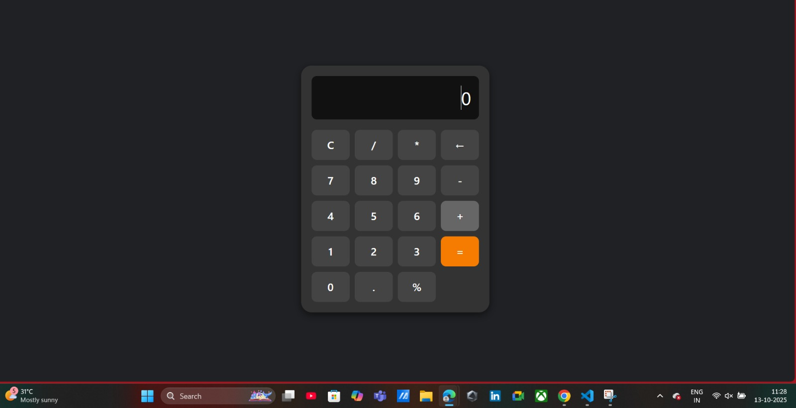
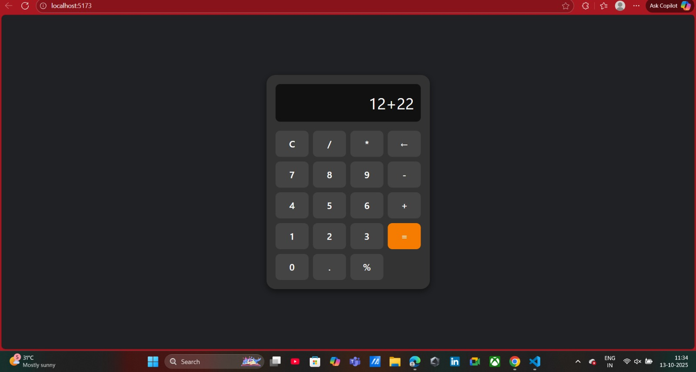
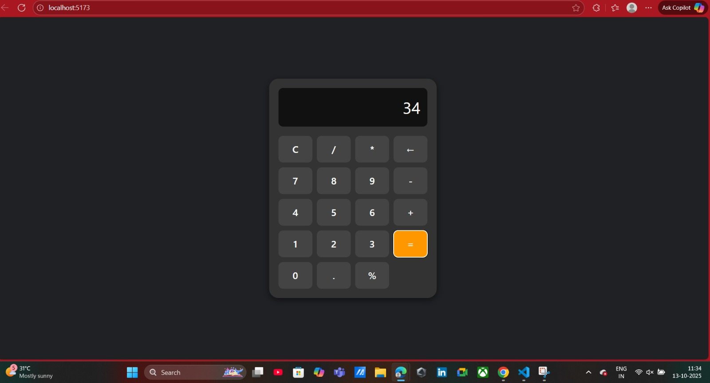

# Ex04 Simple Calculator - React Project
## Date:

## AIM
To  develop a Simple Calculator using React.js with clean and responsive design, ensuring a smooth user experience across different screen sizes.

## ALGORITHM
### STEP 1
Create a React App.

### STEP 2
Open a terminal and run:
  <ul><li>npx create-react-app simple-calculator</li>
  <li>cd simple-calculator</li>
  <li>npm start</li></ul>

### STEP 3
Inside the src/ folder, create a new file Calculator.js and define the basic structure.

### STEP 4
Plan the UI: Display screen, number buttons (0-9), operators (+, -, *, /), clear (C), and equal (=).

### STEP 5
Create a new file Calculator.css in src/ and add the styling.

### STEP 6
Open src/App.js and modify it.

### STEP 7
Start the development server.
  npm start

### STEP 8
Open http://localhost:3000/ in the browser.

### STEP 9
Test the calculator by entering numbers and operations.

### STEP 10
Fix styling issues and refine content placement.

### STEP 11
Deploy the website.

### STEP 12
Upload to GitHub Pages for free hosting.

## PROGRAM

## Calculater.jsx

```
import React, { useState } from "react";
import "./App.css";

export default function Calculator() {
  const [input, setInput] = useState("");

  const handleClick = (value) => {
    if (value === "=") {
      try {
        setInput(eval(input).toString());
      } catch {
        setInput("Error");
      }
    } else if (value === "C") {
      setInput("");
    } else {
      setInput(input + value);
    }
  };

  const buttons = [
    "C", "/", "*", "←",
    "7", "8", "9", "-",
    "4", "5", "6", "+",
    "1", "2", "3", "=",
    "0", ".", "%",
  ];

  return (
    <div className="calculator-container">
      <div className="calculator">
        <div className="display">{input || "0"}</div>
        <div className="buttons">
          {buttons.map((btn, i) => (
            <button
              key={i}
              className={btn === "=" ? "equal" : ""}
              onClick={() => {
                if (btn === "←") setInput(input.slice(0, -1));
                else handleClick(btn);
              }}
            >
              {btn}
            </button>
          ))}
        </div>
      </div>
    </div>
  );
}
```

## Calculater.css
```
body {
  background-color: #202124;
  font-family: 'Segoe UI', sans-serif;
  display: flex;
  justify-content: center;
  align-items: center;
  height: 100vh;
  margin: 0;
}

.calculator-container {
  display: flex;
  justify-content: center;
  align-items: center;
}

.calculator {
  background: #333;
  padding: 20px;
  border-radius: 20px;
  box-shadow: 0 5px 15px rgba(0,0,0,0.5);
  width: 320px;
}

.display {
  background: #111;
  color: #fff;
  font-size: 2.2rem;
  text-align: right;
  padding: 15px;
  border-radius: 10px;
  margin-bottom: 20px;
  overflow: hidden;
}

.buttons {
  display: grid;
  grid-template-columns: repeat(4, 1fr);
  gap: 10px;
}

button {
  background: #444;
  color: white;
  border: none;
  font-size: 1.3rem;
  border-radius: 10px;
  padding: 15px;
  cursor: pointer;
  transition: 0.2s;
}

button:hover {
  background: #666;
}

.equal {
  background: #f57c00;
  grid-column: span 1;
}

.equal:hover {
  background: #ff9800;
}
```

## OUTPUT



## RESULT
The program for developing a simple calculator in React.js is executed successfully.
